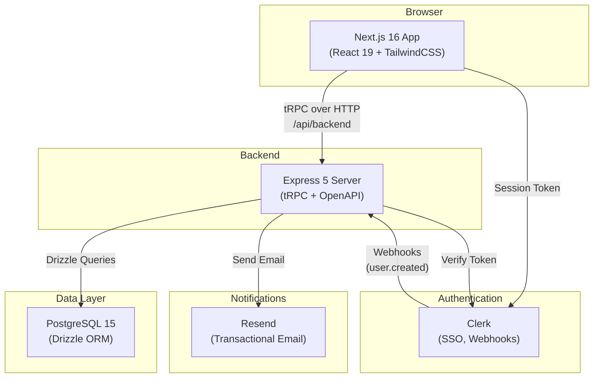
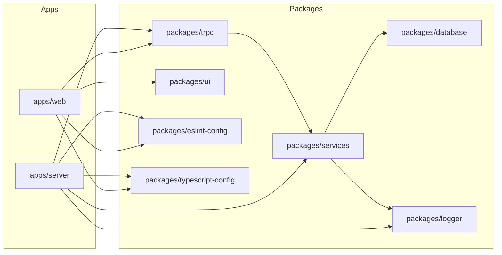
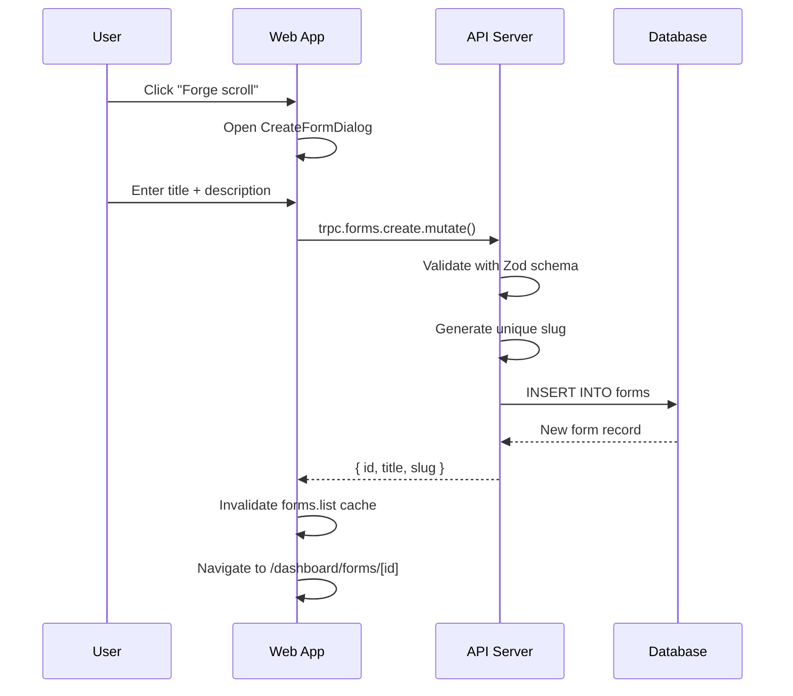
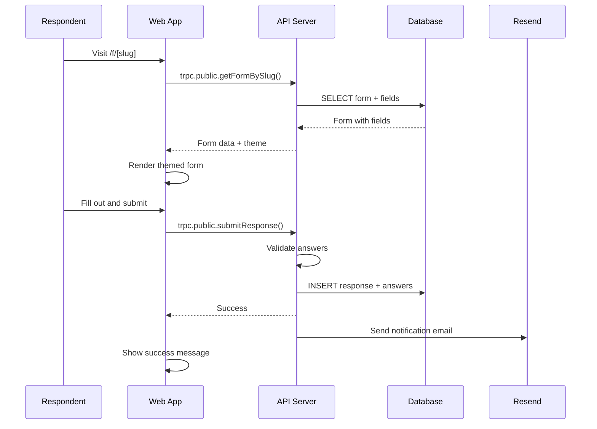
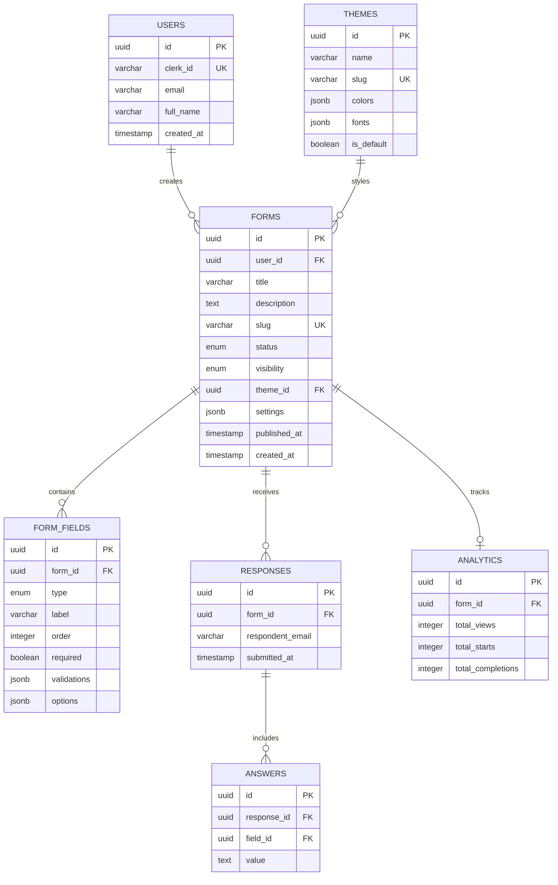

# Architecture — Konoha Forms

This document describes the high-level architecture of the Konoha Forms form builder.

---

## System Overview

---

## Monorepo Structure

---

## Layer Responsibilities

### Apps

| App | Responsibility |
|-----|----------------|
| **web** | Next.js frontend — dashboard UI, form builder, public form renderer, API proxy route (`/api/backend`) |
| **server** | Express API — tRPC handler, Clerk webhook receiver, OpenAPI docs, rate limiting |

### Packages

| Package | Responsibility |
|---------|----------------|
| **database** | Drizzle ORM schema definitions, PostgreSQL migrations, seed scripts |
| **services** | Business logic layer — `FormService`, `ResponseService`, `AnalyticsService`, `ThemeService`, `UserService`, `EmailService` |
| **trpc** | tRPC router definitions (server) + React Query client (client). Shared type contract between apps |
| **ui** | Reusable React components — Button, Badge, etc. |
| **logger** | Structured logging utility with configurable levels |
| **eslint-config** | Shared ESLint rules for the monorepo |
| **typescript-config** | Shared `tsconfig.json` presets |

---

## Data Flow

### Form Creation

### Form Submission (Public)

---

## Database Schema

---

## Authentication Flow

1. **Frontend** — Clerk's `<ClerkProvider>` wraps the app, providing session management
2. **API Proxy** — The web app proxies tRPC calls through `/api/backend/[...path]` to the Express server
3. **Token Forwarding** — The tRPC client attaches the Clerk session token via `Authorization: Bearer <token>` header
4. **Server Verification** — The Express server verifies the token with Clerk's SDK and extracts `userId`
5. **Protected Procedures** — tRPC `protectedProcedure` middleware ensures `ctx.auth.userId` exists

---

## Key Design Decisions

### Why tRPC?
End-to-end type safety between frontend and backend without code generation. The router definitions in `packages/trpc` are shared by both apps.

### Why Drizzle ORM?
Type-safe SQL queries with a thin abstraction layer. Schema-as-code enables easy migration management.

### Why Turborepo?
Efficient monorepo build orchestration with caching. Shared packages avoid code duplication while maintaining clear boundaries.

### Why Clerk?
Production-ready auth with SSO, MFA, webhooks, and a managed user profile UI — lets us focus on the form builder instead of auth infrastructure.

### Why a separate Express server?
Decouples the API from Next.js — enables independent scaling, OpenAPI documentation generation, and webhook handling without Next.js API route limitations.
