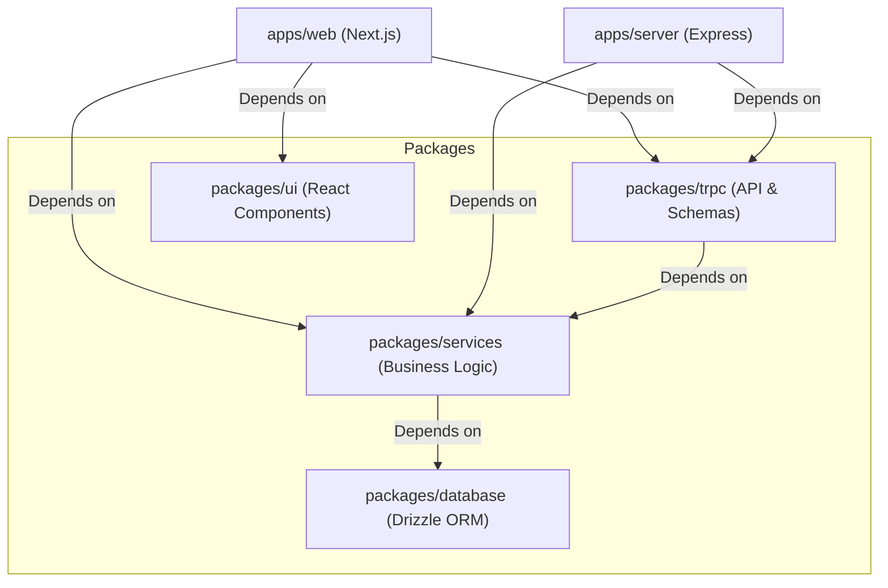

# 🦊 Konoha Form Scrolls

<div align="center">
  

  <br />
  <br />

  
  
  
  
  
  
  
  
  
  <p align="center">
    <strong>A production-grade, dynamic form builder SaaS built with the T3 Stack (Turborepo, Next.js, tRPC, Drizzle).</strong><br />
    Styled with modern web aesthetics inspired by the Hidden Leaf Village. Build forms as powerful as ninjutsu, deploy them instantly, and manage your data beautifully.
  </p>
</div>

---

## 🚀 Live Demo & Links

> [!NOTE]
> **Demo Credentials (for Judges & Testing):**
> - **Email:** `demo@konoha.com`
> - **Password:** `Konoha!Demo2024$`
>
> *(You can also click "Try Sandbox Demo" on the landing page to instantly log in without entering credentials!)*

- **Deployed App**: [https://konoha-forma.dhirenderchoudhary.com/](https://konoha-forma.dhirenderchoudhary.com/)
- **Frontend (Vercel)**: [https://form-builder-web-eight.vercel.app](https://form-builder-web-eight.vercel.app)
- **Backend (Render)**: [https://form-builder-ampl.onrender.com](https://form-builder-ampl.onrender.com)
- **API(Docs)**:[https://konoha-forma.dhirenderchoudhary.com/api/docs](https://konoha-forma.dhirenderchoudhary.com/api/docs)
---

## 📖 Table of Contents

- [Why Konoha Forma?](#-why-konoha-forma)
- [Features](#-features)
- [Tech Stack](#-tech-stack)
- [Architecture & Monorepo](#-architecture--monorepo)
- [Local Development Setup](#-local-development-setup)
- [Environment Variables](#-environment-variables)
- [API Documentation](#-api-documentation)
- [Test Suite](#-test-suite)
- [Contributing](#-contributing)
- [License](#-license)

---

## 🌟 Why Konoha Forma?

Traditional form builders are boring and restrictive. Konoha Forma brings a completely unopinionated and beautiful approach to collecting data. Whether you need a simple contact form, an expansive multi-step survey with conditional logic, or a password-protected unlisted form, this SaaS delivers it with lightning-fast speeds courtesy of Next.js 15 and the T3 Stack.

It serves as both a **powerful user tool** and a **developer showcase** demonstrating how to scale complex React applications using Turborepo, tRPC, Drizzle ORM, and comprehensive Zod validation testing.

---

## ✨ Features

- 📜 **Dynamic Form Builder:** Drag-and-drop forms with a wide variety of field types: Text, Email, Rating, Select, Date, Checkbox, Scale, Radio, and File Uploads.
- 🧠 **Conditional Logic (Jutsu):** Show or hide fields dynamically based on user input to create customized, branching pathways.
- 🔒 **Form Security & Expiry:** Add password protection to your forms or set a hard deadline (`closesAt`) and absolute response limits.
- 🎨 **Custom Themes:** Apply beautiful aesthetics, colors, and branding using the Built-in Theme Picker.
- 📊 **Rich Analytics Dashboard:** Visualize incoming response data with interactive charts, instant CSV exports, and detailed analytics grids.
- 🌍 **Village Map (Explore Grid):** Publish your forms to a public grid for anyone to discover, or keep them unlisted for private sharing.
- 🛡️ **Spam Protection:** Built-in rate limiting and strict response validation schemas via Zod.
- ✉️ **Instant Notifications:** Automated email delivery using Resend whenever a form receives a new submission.
- ⚡ **End-to-End Type Safety:** Guaranteed type safety from the database schema directly to your frontend React components.

---

## 🛠 Tech Stack

### Frontend & UI
- **Framework:** [Next.js 16](https://nextjs.org/) (App Router, React Server Components)
- **Styling:** [Tailwind CSS v4](https://tailwindcss.com/) + [Framer Motion](https://www.framer.com/motion/)
- **State Management & Fetching:** [React Query](https://tanstack.com/query/latest/) (via tRPC)
- **UI Primitives:** [Radix UI](https://www.radix-ui.com/) / [shadcn/ui](https://ui.shadcn.com/)

### Backend & Infrastructure
- **Monorepo:** [Turborepo](https://turbo.build/)
- **API Layer:** [tRPC](https://trpc.io/) (Type-safe Remote Procedure Calls) + OpenAPI via `trpc-to-openapi`
- **Database:** [PostgreSQL](https://postgresql.org/) (Hosted on [Neon Serverless](https://neon.tech/))
- **ORM:** [Drizzle ORM](https://orm.drizzle.team/)
- **Authentication:** [Clerk](https://clerk.com/)
- **Email Service:** [Resend](https://resend.com/)
- **Data Validation:** [Zod](https://zod.dev/)
- **Testing:** [Vitest](https://vitest.dev/)

---

## 🏗 Architecture & Monorepo

The codebase is organized as a **Turborepo monorepo**, ensuring strict boundaries, fast builds, and shared configurations:



---

## 💻 Local Development Setup

Want to run the village infrastructure locally? Follow these steps!

### 1. Clone the repository
```bash
git clone https://github.com/Dhirenderchoudhary/Form_Builder.git
cd Form_Builder
```

### 2. Install Dependencies
Ensure you have [Node.js](https://nodejs.org/) (v18+) and [pnpm](https://pnpm.io/installation) installed.
```bash
pnpm install
```

### 3. Setup Environment Variables
You will need to create an environment file. Copy the example file in the web app:
```bash
cp apps/web/.env.example apps/web/.env
```
*(See the [Environment Variables](#-environment-variables) section below for required keys).*

### 4. Push Database Schema
Sync your PostgreSQL database schema using Drizzle:
```bash
pnpm --filter @repo/database db:push
# Or run migrations:
pnpm --filter @repo/database db:migrate
```

### 5. Ignite the Server
Start the development server across all workspaces:
```bash
pnpm dev
```
The web application will now be running at `http://localhost:3000`.

---

## 🔑 Environment Variables

To run this project locally, you must provide the following variables in `apps/web/.env`:

| Variable | Description | Provider |
|----------|-------------|----------|
| `DATABASE_URL` | PostgreSQL connection string | Neon, Supabase, or Local Postgres |
| `CLERK_SECRET_KEY` | Secret key for Authentication | Clerk Dashboard |
| `NEXT_PUBLIC_CLERK_PUBLISHABLE_KEY` | Public key for Authentication | Clerk Dashboard |
| `CLERK_WEBHOOK_SECRET` | Secret to verify incoming webhooks | Clerk Webhooks |
| `RESEND_API_KEY` | API Key for sending emails | Resend Dashboard |
| `EMAIL_FROM` | Sender email address | E.g. `noreply@yourdomain.com` |
| `NEXT_PUBLIC_API_URL` | Base URL for API requests | Default: `http://localhost:3000` |
| `APP_NAME` | Name of your application | E.g. `KONOHA_FORMS` |

---

## 🧪 Test Suite

Konoha Forms is rigorously tested using **Vitest**. The test suite focuses heavily on the structural integrity of the application, validating Zod schemas and core business logic utilities.

Run all tests across the monorepo:
```bash
pnpm test
```

Run tests with coverage reports:
```bash
pnpm test:coverage
```

### Test Coverage Highlights
- **Schema Validation:** Comprehensive unit tests for all 10+ Zod schemas (`createFormSchema`, `submitResponseSchema`, `conditionalLogicSchema`, etc.) guaranteeing robust API boundary defenses.
- **Service Utilities:** Full edge-case coverage for slug generators and response data validation logic.

---

## 📚 API Documentation

Because we use tRPC, our backend is 100% type-safe. However, we also dynamically generate a standard **OpenAPI 3.0 specification** from our tRPC routers using `trpc-to-openapi`.

You can view the beautifully rendered, interactive API documentation powered by **Scalar** by visiting:

👉 **[https://konoha-forma.dhirenderchoudhary.com/api/docs](https://konoha-forma.dhirenderchoudhary.com/api/docs)**

---

## 🤝 Contributing

Contributions, issues, and feature requests are welcome! 
If you have an idea to improve the platform, feel free to check out the [issues page](https://github.com/Dhirenderchoudhary/Form_Builder/issues).

1. Fork the Project
2. Create your Feature Branch (`git checkout -b feature/AmazingFeature`)
3. Commit your Changes (`git commit -m 'Add some AmazingFeature'`)
4. Push to the Branch (`git push origin feature/AmazingFeature`)
5. Open a Pull Request

---

## 📝 License

This project is [MIT](https://opensource.org/licenses/MIT) licensed. You are free to use, modify, and distribute this software as you see fit.

---

<p align="center">
  <i>Built with ❤️ in the Hidden Leaf Village.</i>
</p>
